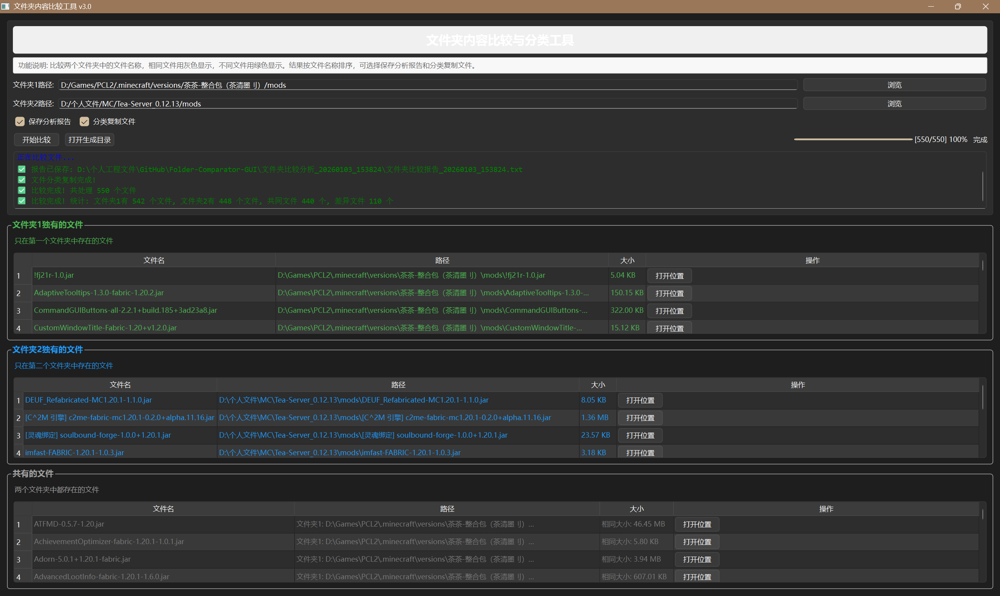

文件夹内容比较工具（GUI 版）
一个基于 PyQt6 的 GUI 工具，用于比较两个文件夹的内容，支持文件分类和报告生成功能。

✨ 功能特点
🖥️ 现代化 GUI 界面 - 使用 PyQt6 构建的用户友好界面

🔍 可视化比较 - 彩色编码结果，易于识别

📊 详细文件信息 - 显示文件名、路径和大小

📁 自动文件分类 - 将文件组织到三个类别中：

文件夹 1 独有的文件（绿色）

文件夹 2 独有的文件（蓝色）

两个文件夹共有的文件（灰色）

📄 报告生成 - 创建详细的比较报告（TXT 格式）

🗂️ 文件整理 - 可选将文件复制到分类文件夹中

⚡ 多线程处理 - 快速处理，实时进度显示

📋 拖拽支持 - 可直接拖拽文件夹到输入框

🔗 快速操作 - 一键打开文件所在位置

## 界面预览

🚀 安装说明
环境要求
Python 3.8 或更高版本

PyQt6 库

安装依赖
bash
pip install PyQt6
📖 使用指南
运行脚本：

bash
python Folder-Comparator-GUI.py
选择文件夹：

手动输入路径或使用浏览按钮

直接将文件夹拖拽到输入框中

配置选项：

选择是否保存报告

选择是否分类和复制文件

开始比较：

点击"开始比较"按钮

查看实时处理进度和结果

查看结果：

文件显示在三个彩色编码的表格中

一键打开文件所在位置

访问生成的报告和整理好的文件

🖼️ 界面截图
(在此添加应用程序的截图)

🛠️ 技术细节
文件结构
text
文件夹比较工具/
├── Folder-Comparator-GUI.py # 主应用程序
├── README.md # 英文说明文档
├── README_zh.md # 中文说明文档
├── requirements.txt # 依赖包列表
└── LICENSE # MIT 许可证
核心功能
拖拽支持 - 轻松选择文件夹

实时进度跟踪 - 多线程处理，实时显示进度

彩色编码界面 - 直观的结果显示

跨平台兼容 - 支持 Windows、Linux、macOS

详细报告 - 生成包含统计信息的详细报告

文件整理 - 自动将文件分类复制到不同文件夹

📊 输出示例
比较完成后，工具会生成以下结构：

text
文件夹比较分析\_20240103_143022/
├── 文件夹 1 独有的文件/ # 包含仅存在于文件夹 1 的文件
├── 文件夹 2 独有的文件/ # 包含仅存在于文件夹 2 的文件
├── 共有的文件/ # 包含两个文件夹都有的文件
└── 文件夹比较报告\_20240103_143022.txt # 详细比较报告
报告内容示例：

text
文件夹比较结果报告
===

生成时间: 2024-01-03 14:30:22
文件夹 1: C:\\Users\\test\\folder1
文件夹 2: C:\\Users\\test\\folder2
===

只在文件夹 1 中的文件:
文件 1.txt
文件 2.jpg

只在文件夹 2 中的文件:
文件 3.png
文件 4.docx

两个文件夹都有的文件:
公共文件 1.pdf
公共文件 2.xlsx

============================================================
统计:
文件夹 1 中的文件总数: 4
文件夹 2 中的文件总数: 4
共同文件数: 2
差异文件数: 4
❓ 常见问题
Q: 工具支持子文件夹比较吗？
A: 当前版本仅比较指定文件夹根目录下的文件，不包含子文件夹。未来版本可能会添加此功能。

Q: 可以比较文件内容而不仅仅是文件名吗？
A: 当前版本主要基于文件名比较。可以通过文件大小差异发现可能的内容不同，但不进行详细的二进制比较。

Q: 处理大量文件时性能如何？
A: 工具使用多线程处理，可以高效处理大量文件。建议将并发线程数设置在 5-10 之间以获得最佳性能。

Q: 支持哪些文件编码？
A: 工具使用 UTF-8 编码处理所有文本内容，包括报告生成。

🔧 高级配置
调整并发线程数
在代码中可以调整最大线程数以获得更好的性能：

python

# 在 FolderCompareThread 类中修改

self.max_threads = 10 # 默认值，可根据需要调整
自定义输出目录
默认情况下，输出目录在脚本所在文件夹。可以修改代码以指定其他位置。

📄 许可证
本项目采用 MIT 许可证 - 查看 LICENSE 文件了解详情。

🤝 贡献指南
欢迎贡献代码！请随时提交 Pull Request。

开发环境设置
克隆仓库：

bash
git clone https://github.com/你的用户名/Folder-Comparator-GUI.git
创建虚拟环境：

bash
python -m venv venv
source venv/bin/activate # Linux/macOS
venv\\Scripts\\activate # Windows
安装开发依赖：

bash
pip install -r requirements.txt
代码规范
遵循 PEP 8 代码风格

添加适当的注释和文档字符串

确保新功能有相应的测试

📞 支持与反馈
如果您遇到任何问题或有功能建议，请：

检查 Issues 是否已有类似问题

创建新的 Issue 描述问题或建议

通过邮箱联系我们

📈 版本历史
v3.0 (当前版本)
完整的 GUI 界面重写

添加拖拽支持

改进的多线程处理

增强的报告功能

v2.0
添加命令行颜色输出

改进文件分类逻辑

添加自动报告生成

v1.0
初始版本

基本文件夹比较功能

简单的文件分类
